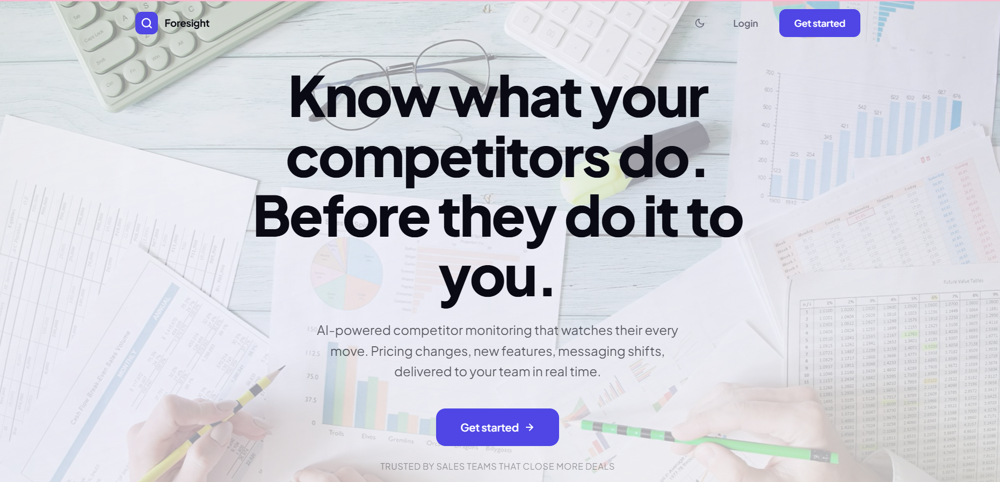
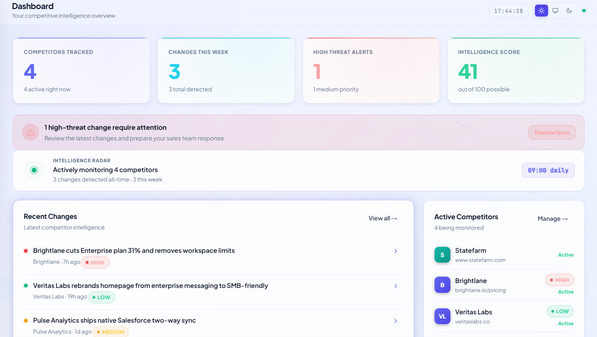
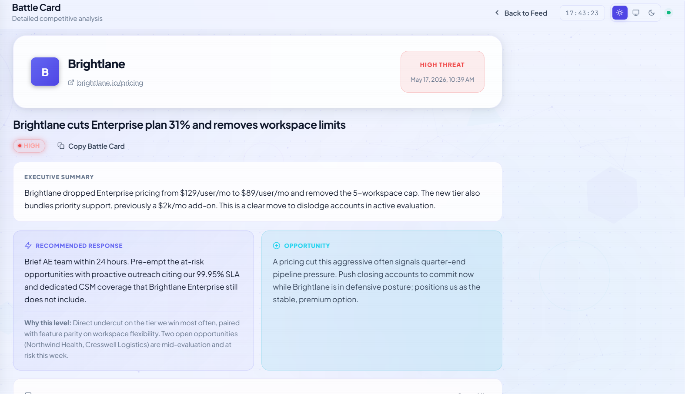

# 🔍 Foresight

*AI-powered competitor intelligence for B2B sales teams.*

## Overview

Foresight watches competitor websites on a schedule, detects meaningful changes, and uses Claude to turn each diff into a structured battle card with threat scoring and a recommended response. Sales teams learn about a competitor's new pricing, feature launch, or messaging shift the day it ships, not weeks later from a deal they lost. The product replaces a manual research process that most B2B teams either skip entirely or assign to whoever has the least to do.

## Why I built this

I demonstrated my ability to scope, develop, and release a true full-stack solution on short notice by building Foresight from start to finish in 48 hours using Claude Code. The choice of WASM SQLite over a native driver, the synchronous DB adapter, the DB-backed session storage, the tier-enforcement layer, the multi-step OTP authentication flow, and the AI prompt structure for combat cards are all architectural choices that I oversaw. The idea was to demonstrate both rapidity and judgment.

## Features

- Email and OTP-based authentication with verification on registration
- Password reset flow with rate-limited OTP delivery
- Three-tier pricing (Free, Pro, Team) with usage enforcement on every protected route
- Competitor monitoring dashboard with paused or active state and per-source change history
- AI-generated battle cards: headline, summary, threat score (low, medium, high), recommended response, and sales talking points
- Slack and Discord webhook alerts when changes are detected
- Daily scheduled checks via cron, with per-competitor manual re-check
- Pre-meeting briefings: connect Google Calendar and get a battle card pushed to your webhook 30 min before any meeting that mentions a tracked competitor (by title or attendee domain)
- Three-mode theme system (system, light, dark) with anti-flash inline detection

## Tech stack

- **Backend**: Node.js, Express
- **Database**: SQLite via sql.js (pure WASM, no native compilation step)
- **AI**: Anthropic API (Claude Sonnet 4.6)
- **Email**: Resend for OTP delivery
- **Sessions**: express-session with a DB-backed store
- **Auth**: bcrypt password hashing with server-side session invalidation
- **Frontend**: Vanilla JS SPA, no framework runtime, dark-first design

## Screenshots







## Running locally

1. Clone the repository:
   ```bash
   git clone https://github.com/UEddy/Foresight.git
   cd Foresight
   ```
2. Install dependencies:
   ```bash
   npm install
   ```
3. Create a local environment file from the template:
   ```bash
   cp .env.example .env
   ```
   At minimum, set `ANTHROPIC_API_KEY` and `RESEND_API_KEY` in the new `.env`. Stripe variables are optional.
4. Start the server:
   ```bash
   npm start
   ```
5. Open http://localhost:3000. Demo data is seeded on first run, and demo credentials are printed to the console.

## Calendar setup (pre-meeting briefings)

Phase 7 connects Google Calendar so Foresight can push a briefing to your Slack/Discord webhook 30 minutes before any meeting that mentions a tracked competitor.

1. **Generate the token-encryption key** and paste it into `.env` as `CALENDAR_TOKEN_ENCRYPTION_KEY`:
   ```bash
   node -e "console.log(require('crypto').randomBytes(32).toString('hex'))"
   ```
2. **Create Google OAuth credentials**:
   - Visit [Google Cloud Console → Credentials](https://console.cloud.google.com/apis/credentials).
   - "Create Credentials" → "OAuth client ID" → application type "Web application".
   - Under "Authorized redirect URIs" add exactly: `http://localhost:3000/api/calendar/google/callback` (replace host for production).
   - Under "APIs & Services → Library", enable the **Google Calendar API**.
   - Paste the client ID and secret into `.env` as `GOOGLE_OAUTH_CLIENT_ID` and `GOOGLE_OAUTH_CLIENT_SECRET`.
3. **Restart the server**, open `/app#/settings`, and click "Connect Google Calendar".
4. While the OAuth app is in "Testing" status, only emails listed under "OAuth consent screen → Test users" can complete the flow. For production, follow Google's app verification process — see "Production OAuth verification" below.

### Production OAuth verification

Before launching publicly, the Google OAuth app must move from "Testing" → "In production" via Google's verification process. While unverified:
- Users hit a "Google hasn't verified this app" warning screen at consent time
- "Continue" requires clicking "Advanced" → "Go to Foresight (unsafe)"
- The 100-user test cap applies

Verification is a separate launch task — submit at OAuth consent screen → "Publish app" with a privacy policy URL, app domain, and brand verification artifacts. Sensitive scopes (Calendar API counts as sensitive) require a 4–8 week review.

## Roadmap

### Next 7 days

- Live Stripe payment integration (currently stubbed in `src/payments.js`)
- Production security hardening: nonce-based CSP, Redis-backed rate limiter, shared session store
- Deploy to a production environment behind HTTPS

### Next 30 days

- Slack slash commands for on-demand competitor lookups
- Win/loss tagging tied to competitor activity, surfacing patterns over time
- Vertical-specific battle card templates (fintech, devtools, healthcare)
- Microsoft 365 Calendar provider (Phase 7 has a Google-only implementation; the abstraction is provider-agnostic)

---

Built by Ediong Udotong.
